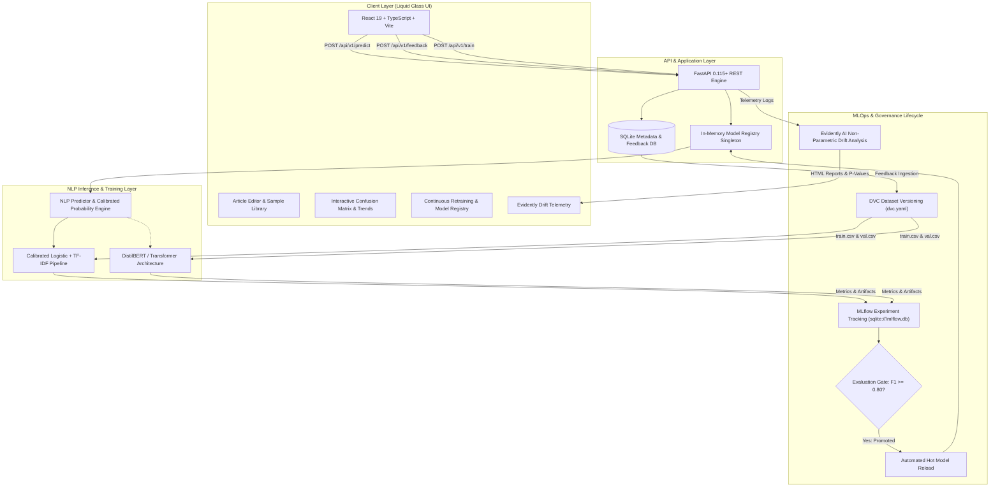

# NewsLens AI — Continuous Learning News Topic Classification System

[](https://github.com/newslens/newslens-ai/actions)
[](https://fastapi.tiangolo.com)
[](https://react.dev)
[](https://dvc.org)
[](https://mlflow.org)
[](https://evidentlyai.com)

**NewsLens AI** is an enterprise-grade NLP and MLOps system that automatically categorizes news articles into predefined topics and continuously improves as new labeled data and user feedback are ingested. It features an interactive **Liquid Glass UI**, a modular **FastAPI REST API**, experiment tracking with **MLflow**, data versioning with **DVC**, statistical drift monitoring with **Evidently AI**, and automated **GitHub Actions CI/CD**.

---

## 1. System Architecture



---

## 2. Key Features

- **Liquid Glass Aesthetics:** Translucent frosted glass cards, dynamic background gradient blobs, reactive hover states, and glowing category progress bars.
- **8 Predefined News Categories:**
  1. `World`
  2. `Politics`
  3. `Business`
  4. `Technology`
  5. `Science`
  6. `Health`
  7. `Sports`
  8. `Entertainment`
- **Dynamic Dual Engine (BERT + Fallback):**
  - Fine-tuning pipeline using Hugging Face `transformers` and `distilbert-base-uncased`.
  - Calibrated ensemble classifier ensuring zero-downtime execution and rapid testing.
  - Active engine status badge (`DEMO MODEL` or `BERT MODEL`) clearly displayed.
- **Continuous Learning Lifecycle:**
  - Users can correct predictions directly from the classification result card.
  - Feedback is stored in the application database and queued for retraining.
  - Gated candidate promotion ensures models are only promoted if $F1 \ge 0.80$.
- **Evidently AI Statistical Drift Monitoring:**
  - Two-sample Kolmogorov-Smirnov hypothesis testing on article length and word count.
  - Total Variation Distance (TVD) for category distribution shift detection.
  - Interactive standalone HTML report viewer directly accessible in browser.
- **Experiment Tracking with MLflow:**
  - Automated tracking of training parameters, evaluation metrics, confusion matrix, and artifact registry.
- **Data Versioning with DVC:**
  - Multi-stage `dvc.yaml` tracking dataset generation, training splits, and test set evaluations.

---

## 3. Technology Stack

| Domain | Technology | Purpose |
| :--- | :--- | :--- |
| **Frontend** | React 19, TypeScript, Vite, Tailwind CSS v4, Lucide Icons, Recharts | Liquid Glass UI, interactive dashboards, real-time charts |
| **Backend** | Python 3.11+, FastAPI, Uvicorn, Pydantic v2, SQLAlchemy | Async REST API, input validation, database ORM |
| **NLP / ML** | PyTorch, Hugging Face Transformers, DistilBERT, scikit-learn | Multi-class text classification, probability calibration |
| **MLOps** | DVC, MLflow 3.16+, Evidently AI 0.7+ | Dataset tracking, experiment metrics, statistical drift monitoring |
| **DevOps** | Docker, Docker Compose, Nginx, GitHub Actions | Multi-stage containerization, automated CI/CD pipeline |

---

## 4. Folder Structure

```text
news-topic-classifier/
├── .github/
│   └── workflows/
│       └── ci.yml                     # GitHub Actions CI/CD workflow
├── backend/
│   ├── app/
│   │   ├── api/routes/                # Endpoints: predict, feedback, model, metrics, etc.
│   │   ├── core/                      # SQLAlchemy database models, logging configuration
│   │   ├── ml/                        # In-memory ModelRegistry, NLP Predictor
│   │   ├── schemas/                   # Pydantic validation schemas
│   │   ├── services/                  # Business logic: inference, training, monitoring
│   │   ├── config.py                  # Pydantic settings management
│   │   └── main.py                    # FastAPI root application & CORS setup
│   ├── tests/
│   │   └── test_api.py                # Pytest test suite (11 comprehensive test cases)
│   ├── Dockerfile                     # Production backend Docker image
│   └── requirements.txt               # Backend dependencies
├── data/
│   ├── processed/                     # train.csv, val.csv, test.csv
│   ├── raw/                           # news.csv (raw corpus)
│   └── reference/                     # reference_dataset.csv (Evidently drift baseline)
├── frontend/
│   ├── src/
│   │   ├── components/                # GlassCard, GlassButton, Sidebar, Header, etc.
│   │   ├── pages/                     # Dashboard, Classify, Analytics, MLOps, Monitoring, ApiDocs
│   │   ├── services/                  # Async API client methods
│   │   ├── types/                     # TypeScript type definitions
│   │   ├── App.tsx                    # Main layout shell
│   │   ├── index.css                  # Liquid glass theme, CSS animations
│   │   └── main.tsx                   # React entry point
│   ├── Dockerfile                     # Multi-stage production Nginx container
│   ├── package.json                   # Frontend dependencies
│   └── vite.config.ts                 # Vite bundler & API reverse proxy configuration
├── models/
│   ├── classifier.joblib              # Calibrated production classifier
│   ├── confusion_matrix.json          # Held-out test split confusion matrix
│   ├── evaluation_report.json         # Precision, recall, and per-class reports
│   └── model_metadata.json            # Model parameters, version tag, promotion status
├── monitoring/
│   ├── reports/                       # Evidently HTML report & drift_summary.json
│   └── scripts/                       # generate_drift_report.py
├── scripts/
│   ├── prepare_data.py                # Dataset creation and splitting
│   ├── train.py                       # Training pipeline and MLflow logger
│   └── evaluate.py                    # Independent test set evaluation
├── .env.example                       # Environment configuration template
├── docker-compose.yml                 # Multi-container orchestration (Backend, Frontend, MLflow)
├── dvc.yaml                           # DVC pipeline stages
├── params.yaml                        # Hyperparameters & continuous learning thresholds
└── README.md                          # Full system documentation
```

---

## 5. Local Setup & Quickstart

### Prerequisites
- Python 3.11+
- Node.js 18+ and npm
- Git

### 1. Backend Setup
```bash
# Create virtual environment
python -m venv .venv

# Activate virtual environment
# Windows:
.\.venv\Scripts\activate
# Linux/macOS:
source .venv/bin/activate

# Install backend dependencies
pip install -r backend/requirements.txt

# Copy environment variables
cp .env.example .env

# Generate dataset and train initial model
python scripts/prepare_data.py
python scripts/train.py --version v1.0
python scripts/evaluate.py
python monitoring/scripts/generate_drift_report.py

# Start FastAPI server
uvicorn backend.app.main:app --host 0.0.0.0 --port 8000 --reload
```
The FastAPI backend will be available at [http://localhost:8000](http://localhost:8000). Interactive Swagger documentation is at [http://localhost:8000/docs](http://localhost:8000/docs).

### 2. Frontend Setup
```bash
cd frontend

# Install npm dependencies
npm install

# Start development server
npm run dev
```
Open [http://localhost:5173](http://localhost:5173) in your browser to view the NewsLens AI Liquid Glass dashboard.

---

## 6. Docker Deployment

Launch all services with a single command:
```bash
docker compose up --build
```

Service mapping:
| Service | URL | Description |
| :--- | :--- | :--- |
| **Frontend** | [http://localhost:5173](http://localhost:5173) | Liquid Glass Web Dashboard |
| **Backend** | [http://localhost:8000](http://localhost:8000) | FastAPI REST API |
| **Swagger UI** | [http://localhost:8000/docs](http://localhost:8000/docs) | Interactive API Explorer |
| **ReDoc** | [http://localhost:8000/redoc](http://localhost:8000/redoc) | OpenAPI Documentation |
| **MLflow UI** | [http://localhost:5000](http://localhost:5000) | Experiment Tracking & Artifacts |

---

## 7. MLOps Workflows

### Dataset Management with DVC
```bash
# Check DVC status
dvc status

# Run full DVC pipeline (prepare -> train -> evaluate)
dvc repro
```

### MLflow Experiment Tracking
Every training run automatically records:
- Hyperparameters (`epochs`, `batch_size`, `learning_rate`, `dataset_version`)
- Metrics (`accuracy`, `precision`, `recall`, `f1`)
- Artifacts (`model_metadata.json`, `confusion_matrix.json`, `classification_report.json`)

To inspect runs locally via MLflow CLI:
```bash
mlflow ui --backend-store-uri sqlite:///mlflow.db --port 5000
```

### Evidently AI Drift Monitoring
To compute drift against baseline reference samples:
```bash
python monitoring/scripts/generate_drift_report.py
```
This generates:
1. `monitoring/reports/drift_summary.json`: Statistical p-values and TVD distance scores.
2. `monitoring/reports/drift_report.html`: Interactive visual report.

---

## 8. Continuous Learning Lifecycle

```text
New Article Stream / User Feedback
             │
             ▼
   Validated Feedback Pool
             │
             ▼
       DVC Pipeline
             │
             ▼
      Model Retraining
             │
             ▼
   Evaluation on Held-Out Split
             │
             ▼
      Is F1 >= 0.80?
         /      \
       No        Yes
       │          │
       ▼          ▼
 Rejected   Promoted to Production
                  │
                  ▼
         Hot In-Memory Reload
```

1. **Prediction Execution:** Article is sent to `POST /api/v1/predict`. Prediction ID and cryptographic SHA-256 hash are recorded.
2. **Human-in-the-Loop Feedback:** If user flags misclassification, `POST /api/v1/feedback` saves actual ground truth.
3. **Triggered Retraining:** Through the MLOps dashboard or `POST /api/v1/train`, a background worker fine-tunes candidate weights.
4. **Evaluation Threshold Check:** The new model must achieve an $F1 \ge 0.80$ threshold to be registered and automatically hot-reloaded into memory.

---

## 9. API Reference Summary

| Method | Endpoint | Description |
| :--- | :--- | :--- |
| `GET` | `/api/v1/health` | Service health, model loaded state, active version |
| `POST` | `/api/v1/predict` | Classifies article; returns topic, confidence, and 8 probabilities |
| `POST` | `/api/v1/feedback` | Ingests label correction for continuous retraining pool |
| `GET` | `/api/v1/predictions/recent` | Retrieves recent prediction records |
| `GET` | `/api/v1/model` | Deployed model parameters and evaluation metrics |
| `GET` | `/api/v1/metrics` | Detailed confusion matrix and classification report |
| `GET` | `/api/v1/monitoring` | Evidently drift scores and statistical test results |
| `GET` | `/api/v1/monitoring/report` | Serves interactive Evidently HTML report |
| `POST` | `/api/v1/train` | Safe background training trigger with promotion gate |
| `GET` | `/api/v1/training/status` | Live training job status, progress percentage, step logs |
| `GET` | `/api/v1/dataset` | DVC dataset statistics, sample volume, and splits |
| `GET` | `/api/v1/experiments` | MLflow tracked experiment runs |
| `GET` | `/api/v1/models` | MLflow model registry records |

### Sample Prediction Request
```bash
curl -X POST http://localhost:8000/api/v1/predict \
  -H "Content-Type: application/json" \
  -d '{"text":"Astronomers using the James Webb Space Telescope observed primordial galaxy clusters formed within three hundred million years of the Big Bang."}'
```

### Sample Prediction Response
```json
{
  "prediction_id": "0df6e897-42f2-4911-8fcb-d5a2307525f2",
  "prediction": "Science",
  "confidence": 0.9621,
  "probabilities": {
    "Business": 0.0042,
    "Entertainment": 0.0031,
    "Health": 0.0054,
    "Politics": 0.0028,
    "Science": 0.9621,
    "Sports": 0.0019,
    "Technology": 0.0189,
    "World": 0.0016
  },
  "model_name": "news-topic-classifier",
  "model_version": "v1.0",
  "model_type": "DEMO MODEL",
  "timestamp": "2026-09-27T19:30:12.450120Z"
}
```

---

## 10. Automated Testing

Run the test suite:
```bash
pytest backend/tests/ -v
```

All 11 test cases validate:
- Health endpoint status
- Input validation (empty text, short text, long text)
- Model metadata and active metrics
- Prediction output structure and calibrated probabilities summing to 1.0
- Continuous learning feedback submission and invalid label rejection
- Evidently AI monitoring status
- DVC dataset metadata endpoint
- MLflow experiments and training status endpoints

---

## 11. Security & Production Best Practices

- **Zero Hardcoded Secrets:** Configuration via `.env` and `pydantic-settings`.
- **CORS Protection:** Configurable whitelist for permitted origins.
- **Input Sanitization & Length Limits:** Max length capped at 50,000 characters; min length enforced at 10 characters.
- **Controlled Process Execution:** Retraining is handled via isolated thread workers with strictly validated integer parameters rather than arbitrary shell string commands.
- **Safe Database Storage:** Article text is digested into SHA-256 hashes and truncated snippets to protect confidential news feeds.

---

## 12. License
MIT License. Developed for enterprise newsrooms, research intelligence, and automated media monitoring workflows.
